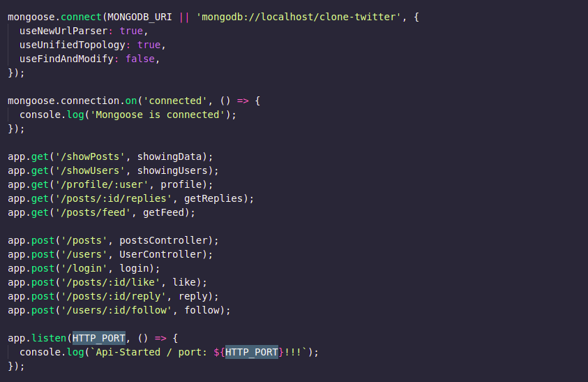

# Clone-Twitter



## 🔖 Sobre
O backend desenvolvido, tem por finalidade simular algumas das funcionalidades mais famosas presentes no Twitter. Dentre elas o login, like, reply, post, etc...

## 🛠 Tecnologias

Esse projeto foi desenvolvido com as seguintes tecnologias:

- [Express](https://expressjs.com/pt-br/)
- [MongoDB](https://www.mongodb.com/2)
- [jsonwebtoken](https://www.npmjs.com/package/jsonwebtoken)
- [bcrypt](https://www.npmjs.com/package/bcrypt)


## 🗂 Como baixar e iniciar o projeto

```bash
# Abra um terminal e copie este repositório com o comando
$ git clone https://github.com/carlos-mattos/nps.git
# ou use a opção de download.

# Entre na pasta server 
$ cd server

# Instale as dependências
$ npm install

# Rode o servidor
$ npm run dev
```

Desenvolvido por [Carlos Eduardo](https://www.linkedin.com/in/carlos-eduardo-andrade-de-mattos-a060b1182/) 🤓
